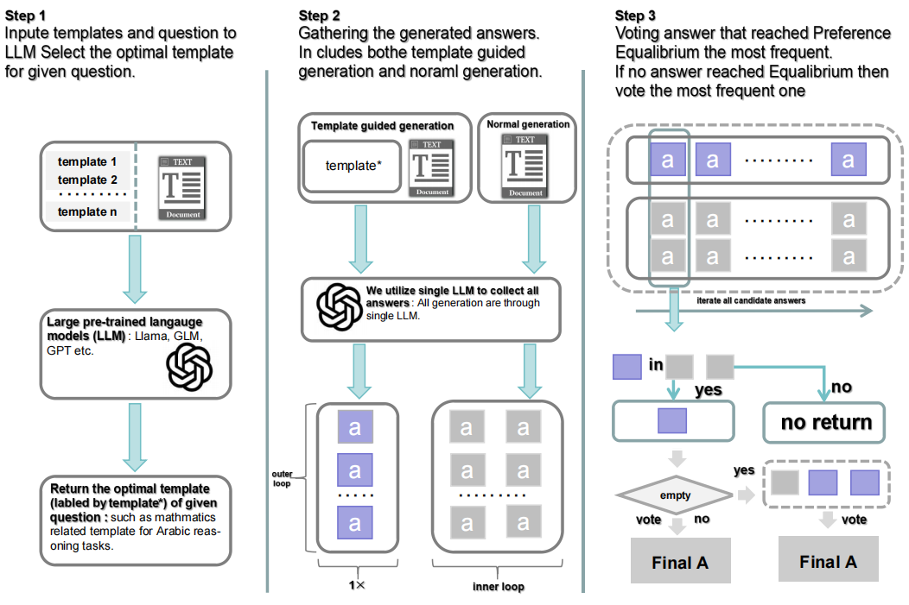

# Nash Chain-of-Thought (CoT)

*Description:* This is the official codebase of Nash CoT

### What's CoT

CoT is a *step-by-step* manner inference approach. 

Requirement (Here, we provide single template case for CoT): we have <!-- question x -->, <!-- prompt: 'Let's think step by step' -->, <!-- trigger: 'Therefore, the answer is:' --> 

This approach is composed of two steps:

- Step1 (obtain rational): Generating rational: z=LLM( |x, prompt)
- Step2 (obtain answer)  : Obtain answer      : a=LLM( |x, prompt, z, trigger)

### Multi-path inference with CoT

Previously, self-consistency[2] showcase that multi-path CoT inference with voting the highest frequency answer can improve the accuracy of prediction. However, it's computing in-sufficient to conduct multi-path inference. Therefore, we propose Nash CoT to solve this limitation.

### The framework of Nash CoT:

Nash CoT utilize question related contextual information as the template to inference in each path, while utilizing Preference Equilibrium to allivate overconfident generation.



### Configuration

```c
cd nash-chain-of-thought && pip install -r requirements.txt
```

### How to run our code?

```c
sh run_nash_cot.sh data_setname random_seed tokenizer_path model_path
```

### We list severl un-controllabel factors:

- We find that any LLM has their own features, such that once giving some prompt, llama3 can direct answer the question, but Mistral-Instruct (7B) requires pre-defined trigger to guide to deliver the final answer.
- We find that the template is are

### If you utilize our codebase, please cite below:

```c
@article{,
title={Nash CoT: Multi-Path Inference with Preference Equilibrium}, 
author={Ziqi Zhang and Cunxiang Wang and Xiong Xiao and Yue Zhang and Donglin Wang},
year={2024},
eprint={},
archivePrefix={arXiv},
}
```

### Thanks 

We utilize these models: GLM4-chat (9B)[4], Mistral-Instruct (7B)[5], we are also welcomed friends further evaluate Nash CoT with LLama3-Instruct [6], however, there are some concerns metioned above (*We list severl un-controllabel factors*). 

Our codebase is modified from the codebase of Automatic CoT, and our local decoder is built based on Huggingface Transformer

Addtionally, thanks my collaberator: Cunxiang Wang

This reseach is fincially supported by MiLab at WestLake Univeristy.


# Collaberation 

If you can find out any kinds of new usages of Nash CoT, we are welcomed to be contacted and supplyment new emergent experimental results! For instance, 1) You conduct evaluation on LLama, GPT, etc. 2) You find out this approach can be scaled to other setting such as controllable generation  

Both of my E-mile (stevezhangz98a@gmail.com) and adding new blog to this project are welcomed. 

### *Reference*

[1] Jason Wei, Xuezhi Wang, Dale Schuurmans, Maarten Bosma, Brian Ichter, Fei Xia, Ed Chi, Quoc Le, Denny Zhou. 2022. Chain-of-Thought Prompting Elicits Reasoning in Large Language Models. Preprint. arXiv: 2201.11903.

[2] Xuezhi Wang, Jason Wei, Dale Schuurmans, Quoc Le, Ed Chi, Sharan Narang, Aakanksha Chowdhery, Denny Zhou. 2022. Self-Consistency Improves Chain of Thought Reasoning in Language Models. Preprint. arXiv: 2203.11171.

[3] Zhuosheng Zhang, Aston Zhang, Mu Li, Alex Smola. 2022. Automatic Chain of Thought Prompting in Large Language Models. Preprint. arXiv: 2210.03493.

[4] Aohan Zeng, Xiao Liu, Zhengxiao Du, Zihan Wang, Hanyu Lai, Ming Ding, Zhuoyi Yang, Yifan Xu, Wendi Zheng, Xiao Xia, Weng Lam Tam, Zixuan Ma, Yufei Xue, Jidong Zhai, Wenguang Chen, Peng Zhang, Yuxiao Dong, Jie Tang. 2022. GLM-130B: An Open Bilingual Pre-trained Model. Preprint. arXiv: 2210.02414.

[5] Albert Q. Jiang, Alexandre Sablayrolles, Arthur Mensch, Chris Bamford, Devendra Singh Chaplot, Diego de las Casas, Florian Bressand, Gianna Lengyel, Guillaume Lample, Lucile Saulnier, Lélio Renard Lavaud, Marie-Anne Lachaux, Pierre Stock, Teven Le Scao, Thibaut Lavril, Thomas Wang, Timothée Lacroix, William El Sayed. 2022. Mistral 7B. Preprint. arXiv: 2310.06825.

[6] 
